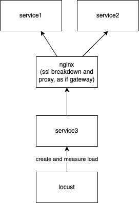

# Content
- Microservice 1 - FastAPI application
- Microservice 2 - FastAPI application
- Orchestrator microservice 3 - FastAPI
- NGINX to serve as proxy between 3 and [1, 2]
- Locst to perform load testing

# Results
On local machine (no SSL, only http), response times of 11ms median

# Build certs
Before ruttning, you have to setup some certs. This can be done by running `ssl-creation.sh`

# Architecture
